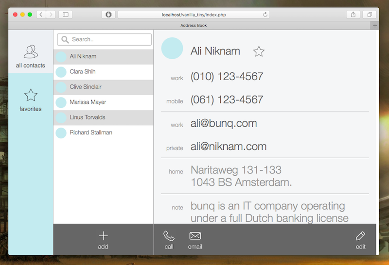

# Vanilla Tiny

This is a simple demo Address book web app, that uses no CSS/Javascript framework whatsoever.

It's based on [TINY](https://github.com/panique/tiny), an extremely simple and easy to understand config-free MVC PHP application.
It does not need mod_rewrite and therefore runs everywhere. 

Vanilla Tiny includes some REST endpoints to get data in JSON format. This data is retrieved with AJAX calls to the server. 

## Features

- no CSS framework has been used (no Bootstrap, no Foundation, etc)
- no Javascript framework involved (no jQuery, no Angular, etc), just Vanilla Javascript
- the address book is retrieved at runtime with a xmlHttpRequest
- once a person is selected from the list, all the contact details appear on the right side
- it is possible to show all or only favorite contacts
- it is possible to filter the list using the search bar
- a person can be added/removed from favorites clicking on the star icon

## Requirements

- PHP 5.3.0+
- MySQL
- a modern Web Browser

## Installation

1. If you run Vanilla Tiny from within a sub-folder, edit the folder's name in application/config/config.php and change 
`define('URL_SUB_FOLDER', 'vanilla_tiny');`. If you don't use a sub-folder, then simply comment out this line.  
2. Edit the database credentials in `application/config/config.php`
3. Execute the .sql statements in the `_installation/`-folder (with PHPMyAdmin for example).

## Final Thoughts

Special thanks to [YOU MIGHT NOT NEED JQUERY](http://youmightnotneedjquery.com/) for the useful guide.

